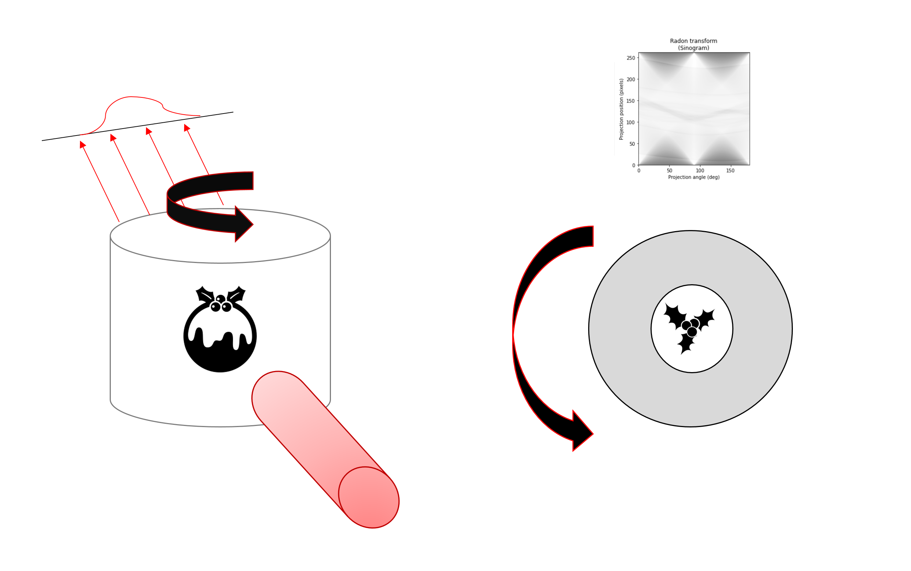

** WARNING: CONTAINS MATHEMATICAL CONCEPTS **

In tomography a 3D image is reconstructed from an angular series of projections through that object, called a line intergral or Radon Transform. Look at the diagram below and you can see the projections of a christmas pudding in a tin that is being rotated through a beam.  If we look at these line itergrals over the angular projections we get a Sinogram. The wavey lines of the sinogram in the plot at the top right of the pudding image show the types of patterns we get from tomography.

Sinograms play a big role in tomography, and are critical to get a good reconstruction of your data. Sinograms are very beautiful and don't get the appreciation they deserve. When simulated, sinograms give us  very nice twinkly patterns that we can render in lights. Here we have simulated sinograms and then programmed the lights to show you these lovely patterns. A bit of an abstract concept but worth it!
