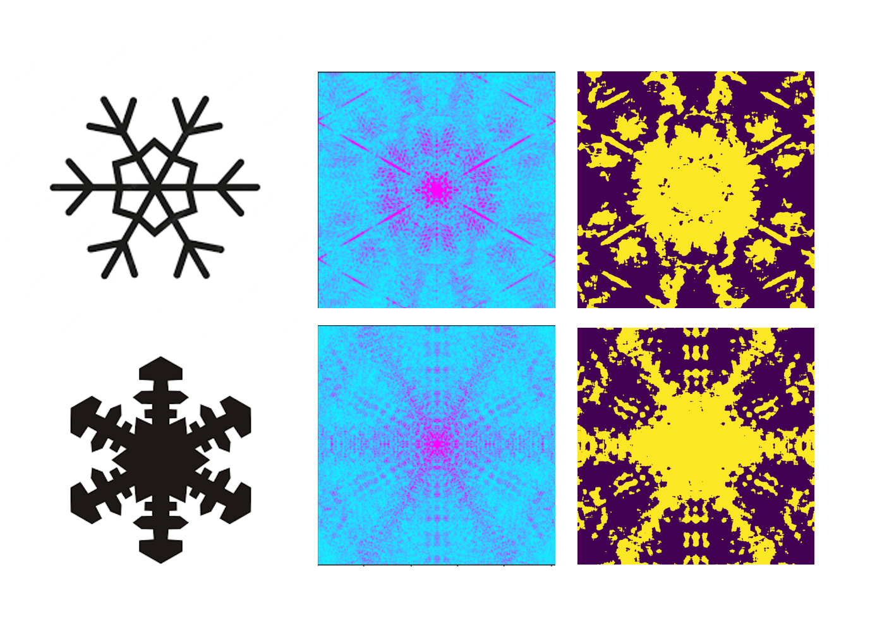

# Snowflake Diffraction

In much of electron microscope and x-ray imaging we measure the diffraction patterns of the object and use a computer program to recreate the structures from the diffraction pattern.
Diffraction is a phenomenon that occurs when a wave passes through an aperture, a similar size to it's wavelength. You can see this in picture of the bay below (https://www.flickr.com/photos/ozzrod/33811299806), where the distance of the cliffs is equivalent to the wavelengths of the waves passing through.

Luckily for us, the wavelength of x-rays and electrons match the spaces between atoms or molecules in a crystal , which is what allows us to image them. The diffraction pattern is related to the structure of the object that made it by a mathematical expression called the Fourier Transform. So if we measure the diffraction patterns emerging from crystals we can use Fourier Theory to infer their structure. In our wave example above the Fourier Transform of the gap in the cliffs gives the curved shape we see in the waves. 

Diffraction patterns are very beautiful and we don't look at  them often, instead focussing on the molecular structures that they gives us. AI has used this opportunity to give diffraction patterns a chance to shine by simulating the diffraction patterns of these beautiful snowflakes and then using that to create decorations. The images below show the images of the snowflakes and the diffraction patterns that were made from them. 

We then used blurring and thresholding techniques to create masks from the intricate diffraction that we could then use to create christmas tree decorations. Some were painted onto baubles with metallic paints, and some were laser cut out of wood. For the full code to make these masks, please go to: https://github.com/rosalindfranklininstitute/christmastree2022
